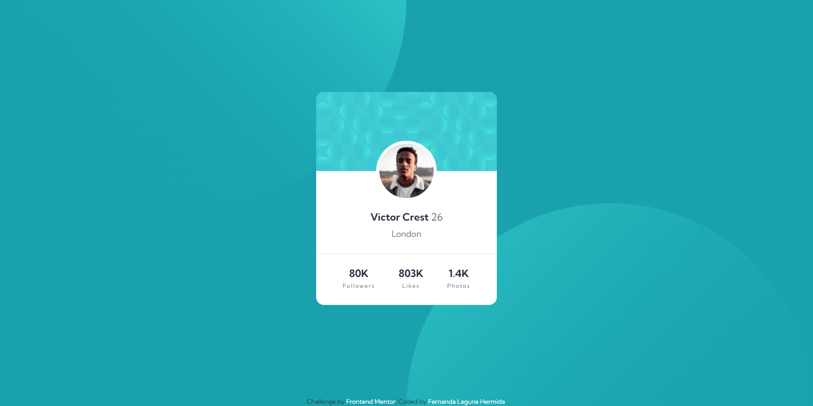
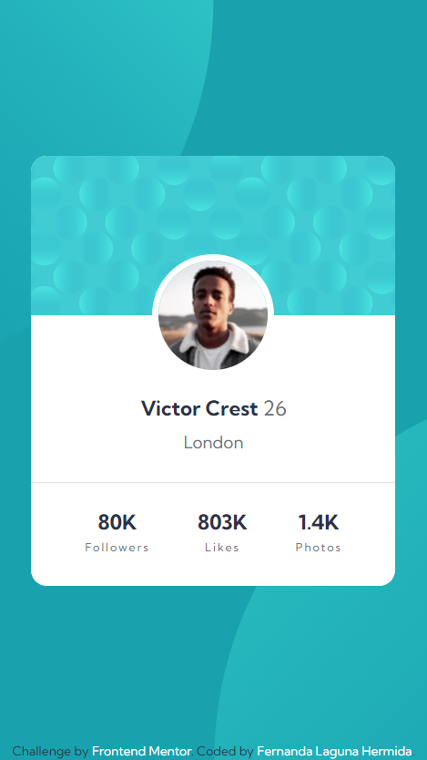

# Frontend Mentor - Profile card component solution

This is a solution to the [Profile card component challenge on Frontend Mentor](https://www.frontendmentor.io/challenges/profile-card-component-cfArpWshJ). Frontend Mentor challenges help you improve your coding skills by building realistic projects. 

## Table of contents

- [Overview](#overview)
  - [The challenge](#the-challenge)
  - [Screenshot](#screenshot)
  - [Links](#links)
- [My process](#my-process)
  - [Built with](#built-with)
  - [What I learned](#what-i-learned)
  - [Continued development](#continued-development)
  - [Useful resources](#useful-resources)
- [Author](#author)

## Overview

### The challenge

- Build out the project to the designs provided

### Screenshot

### Links

- Solution URL: [Add solution URL here](https://your-solution-url.com)
- Live Site URL: https://ferlagher.github.io/FMC-Profile-card-component/

## My process

As before, I started with the HTML structue, but this time I used SASS to give it the styles.

### Built with

- Semantic HTML5 markup
- CSS custom properties
- Flexbox
- CSS Grid
- SASS

### What I learned

I love SASS, i'ts very intuitive and easy to use. at least by now. I want to learn more.

### Continued development

Next challenge: [Order summary component](https://www.frontendmentor.io/challenges/order-summary-component-QlPmajDUj)

### Useful resources

- [W3Schools](https://www.w3schools.com)

## Author

- LinkedIn - [ferlagher](https://www.linkedin.com/in/ferlagher/)
- Frontend Mentor - [@ferlagher](https://www.frontendmentor.io/profile/ferlagher)
- Instagram - [@ferlagher](https://www.instagram.com/ferlagher/)

Thank you very much for reading. ♥